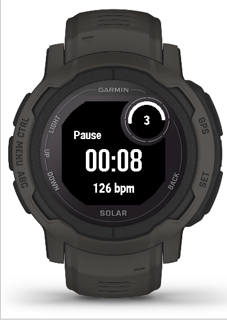

This is a small app for Garmin Watches (only Descent G1 for now) to do interval training sets.

From the Start screen, press Menu to set your times for the active/workout phase, and the break phase in 15sec units; as well as the number of intervals you want to repeat (active time and pause time count as one interval). These settings will be stored on the watches' memory and re-used next time you start the app, until new values are chosen.

Active phases and breaks start with two short vibrations, end of the whole workout is signalled by one longer vibration. The display will show the time of the current phase (active vs pause) in the center, the heart rate at the bottom, and the current round in the upper right area of the screen.

This is an alpha version, which does not store the training data yet (this will be the next update). As I only have the Garmin Descent G1, this is all I can test on for now. Future releases, hopefully, will include other models.

To install: connect your Garmin Descent G1 via USB to your comoputer, and copy the file intervals.prg into the //GARMIN/APPS folder on the watch.